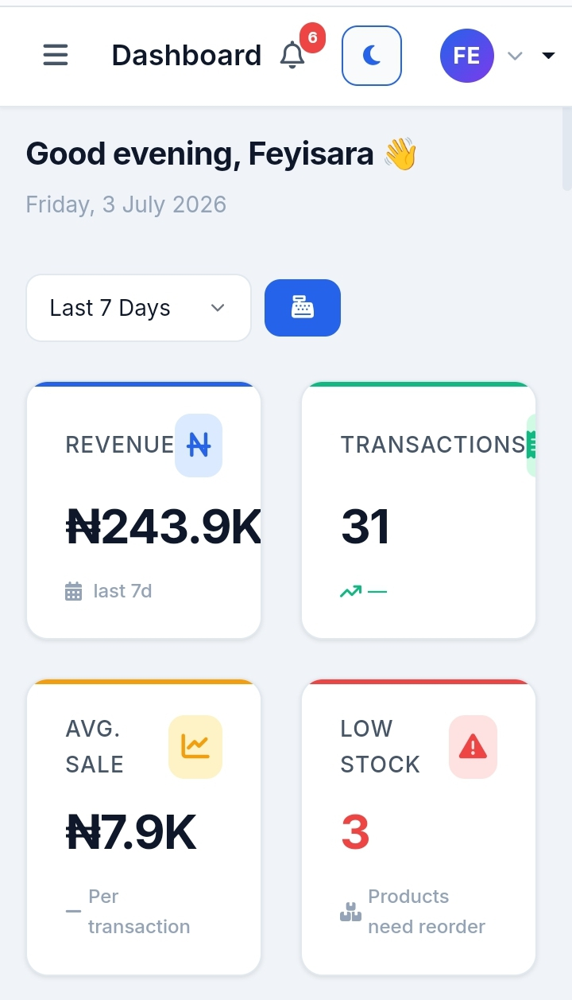
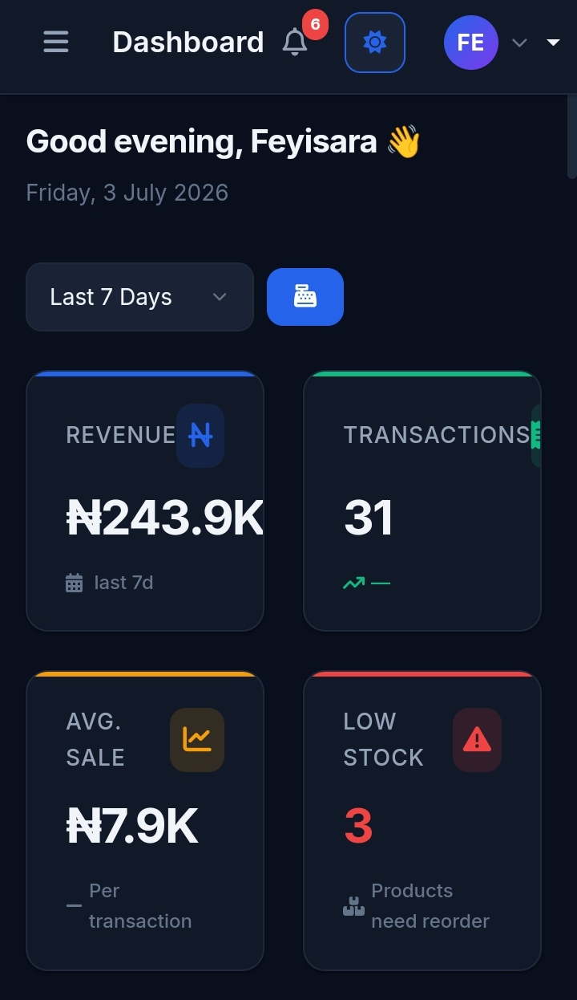

# 📊 LedgerPulse — A Progressive Web-Based Inventory & Sales Management Platform for Nigerian SMEs

[](https://ledgerpulse.netlify.app/)
[]
[]
[]

**LedgerPulse** is a modern, mobile-first Progressive Web Application (PWA) designed to help Nigerian Small and Medium-sized Enterprises (SMEs) manage inventory, monitor stock levels, record sales, and generate business reports digitally.

Developed as an undergraduate **Final Year Project in Information Technology**, LedgerPulse replaces traditional paper-based record keeping with an intuitive offline-capable web application that continues to function even without an internet connection.

---

# 🌐 Live Demo

🚀 **Visit the application**

https://ledgerpulse.netlify.app/

---

# 📷 Screenshots

## Dashboard (Light Mode)



## Dashboard (Dark Mode)



---

# 🔑 Getting Started

The application creates its administrator account during first launch.

1. Open the application.
2. Complete the administrator setup wizard.
3. Sign in using the credentials you created.
4. Begin managing products, inventory and sales.

---

# 📝 Problem Statement

Many retail SMEs across Nigeria still depend on handwritten ledger books or manual record keeping for tracking inventory and daily sales.

This approach often leads to:

- Loss of important business records
- Incorrect stock counts
- Manual calculation errors
- Poor sales tracking
- Limited business insights
- Difficulty monitoring inventory in real time

LedgerPulse was developed to provide an affordable digital alternative that is simple to use, installable on mobile devices, and capable of operating even without internet access.

---

# 🎯 Project Objectives

The primary objective of LedgerPulse is to provide Nigerian SMEs with a modern inventory and sales management platform that enables users to:

- Digitally manage inventory
- Record sales efficiently
- Monitor stock levels
- View sales analytics
- Operate offline using Progressive Web App technology
- Improve business decision-making through organized data

---

# ✨ Features

## 🔐 Authentication

- Administrator account setup wizard
- Secure login system
- Password strength indicator
- Remember Me functionality
- Dark and Light themes

---

## 📦 Product Management

- Add new products
- Edit products
- Delete products
- Product categorization
- SKU management

---

## 📦 Inventory Management

- Track stock quantities
- Stock adjustment
- Low-stock monitoring
- Reorder level configuration

---

## 💰 Point of Sale (POS)

- Fast checkout interface
- Automatic inventory updates
- Receipt generation
- Multiple payment methods

---

## 📊 Reports & Analytics

- Sales dashboard
- Revenue summaries
- Product performance
- Chart.js visualizations
- Sales filtering
- CSV export
- PNG report export

---

## 📱 Progressive Web App (PWA)

- Installable on supported devices
- Works offline
- Service Worker caching
- Mobile-first responsive design
- Fast loading experience

---

# ✅ Current Features

- ✅ Mobile-first responsive interface
- ✅ Progressive Web App (PWA)
- ✅ Offline support
- ✅ Administrator authentication
- ✅ Dashboard analytics
- ✅ Product management
- ✅ Inventory management
- ✅ Sales management
- ✅ Point of Sale (POS)
- ✅ Business reports
- ✅ Dark & Light Mode
- ✅ Local data persistence using LocalStorage

---

# 🛠 Technologies Used

### Frontend

- HTML5
- CSS3
- JavaScript (ES6)
- Bootstrap 5.3.2

### Libraries

- Chart.js
- Bootstrap Icons
- Font Awesome

### Browser APIs

- LocalStorage API
- Service Worker API
- Web App Manifest

### Deployment

- Netlify
- GitHub

---

# 📂 Project Structure

```text
LedgerPulse/
│
├── assets/
│   ├── css/
│   ├── icons/
│   ├── images/
│   └── js/
│
├── pages/
│   ├── dashboard.html
│   ├── inventory.html
│   ├── products.html
│   ├── pos.html
│   ├── reports.html
│   ├── sales.html
│   └── settings.html
│
├── index.html
├── offline.html
├── manifest.json
├── sw.js
└── README.md
```

---

# 💻 Run Locally

Clone the repository

```bash
git clone https://github.com/yourusername/LedgerPulse.git
```

Open the project folder.

Run the application using **Live Server** (VS Code) or any local web server.

---

# 🚀 Future Improvements

Potential enhancements include:

- Cloud database integration
- User role management
- Barcode scanner support
- Supplier management
- Customer management
- Email password recovery
- Multi-branch inventory
- Data synchronization across devices
- Sales forecasting and predictive analytics

---

# 👨‍💻 Author

**Mofeyisara Okunola**

- Undergraduate Information Technology Student
- National Open University of Nigeria (NOUN)

---

# 📄 Academic Information

This project was developed as an undergraduate **Final Year Project** in partial fulfillment of the requirements for the award of a Bachelor of Science (B.Sc.) degree in Information Technology.

The project demonstrates the practical application of modern web technologies—including Progressive Web Apps, responsive design, offline-first architecture, and client-side data management—to solve real-world inventory and sales management challenges faced by Nigerian SMEs.

---

# 📜 License

This project is intended for academic purposes only.

© 2026 Mofeyisara Okunola. All Rights Reserved.